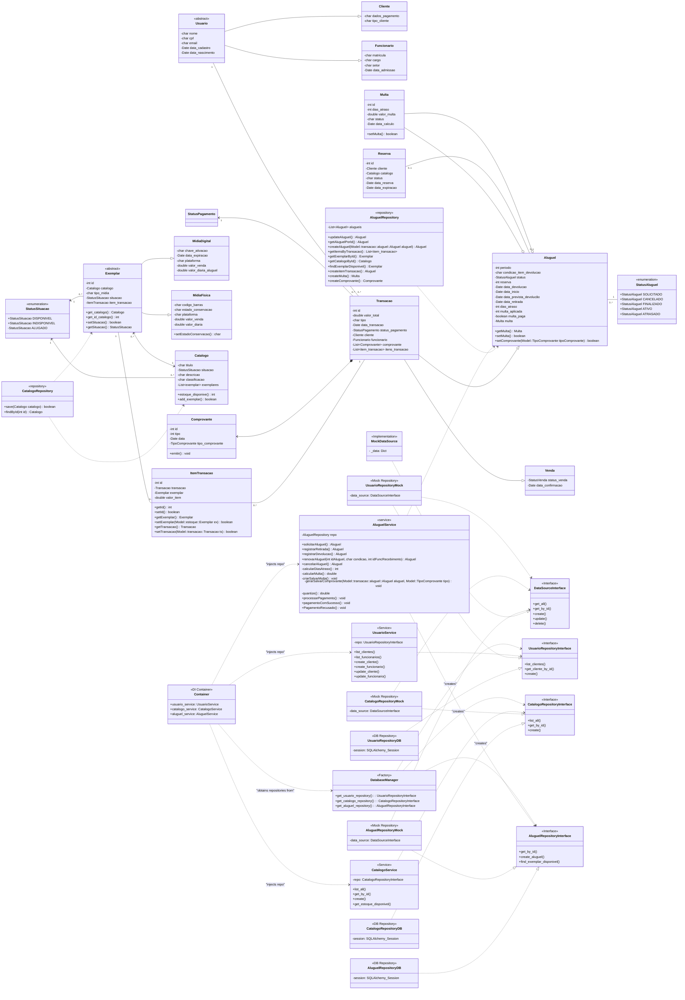

```mermaid
classDiagram
    direction LR

    class StatusPagamento
    class Usuario {
        <<abstract>>
        -char nome
        -char cpf
        -char email
        -Date data_cadastro
        -Date data_nascimento
    }
    class Cliente {
        -char dados_pagamento
        -char tipo_cliente
    }
    class Funcionario {
        -char matricula
        -char cargo
        -char setor
        -Date data_admissao
    }
    class Exemplar {
        <<abstract>>
        -int id
        -Catalogo catalogo
        -char tipo_midia
        -StatusSituacao situacao
        -ItemTransacao item_transacao
        +get_catalogo() Catalogo
        +get_id_catalogo() int
        +setSituacao() boolean
        +getSituacao() StatusSituacao
    }
    class MidiaDigital {
        -char chave_ativacao
        -Date data_expiracao
        -char plataforma
        -double valor_venda
        -double valor_diaria_aluguel
    }
    class MidiaFisica {
        -char codigo_barras
        -char estado_conservacao
        -char plataforma
        -double valor_venda
        -double valor_diaria
        +setEstadoConservacao() char
    }
    class Catalogo {
        -char titulo
        -StatusSituacao situacao
        -char descricao
        -char classificacao
        -List~exemplar~ exemplares
        +estoque_disponive() int
        +add_exemplar() boolean
    }
    class StatusSituacao {
        <<enumeration>>
        +StatusSituacao DISPONIVEL
        +StatusSituacao INDISPONIVEL
        -StatusSituacao ALUGADO
    }
    class Transacao {
        -int id
        -double valor_total
        -char tipo
        -Date data_transacao
        -StatusPagamento status_pagamento
        -Cliente cliente
        -Funcionario funcionario
        -List~Comprovante~ comprovante
        -List~item_transacao~ itens_transacao
    }
    class Comprovante {
        -int id
        -int tipo
        -Date data
        -TipoComprovante tipo_comprovante
        +emitir() void
    }
    class Aluguel {
        -int periodo
        -char condicao_item_devolucao
        -StatusAluguel status
        -int reserva
        -Date data_devolucao
        -Date data_inicio
        -Date data_prevista_devolucão
        -Date data_retirada
        -int dias_atraso
        -int multa_aplicada
        -boolean multa_paga
        -Multa multa
        +getMulta() Multa
        +setMulta() boolean
        +setComprovante(Model::TipoComprovante tipoComprovante) boolean
    }
    class Multa {
        -int id
        -int dias_atraso
        -double valor_multa
        -char status
        -Date data_calculo
        +setMulta() boolean
    }
    class Reserva {
        -int id
        -Cliente cliente
        -Catalogo catalogo
        -char status
        -Date data_reserva
        -Date data_expiracao
    }
    class Venda {
        -StatusVenda status_venda
        -Date data_confirmacao
    }
    class AluguelService {
        <<service>>
        -AluguelRepository repo
        +solicitarAluguel() Aluguel
        +registrarRetirada() Aluguel
        +registrarDevolucao() Aluguel
        +renovarAluguel(int idAluguel, char condicao, int idFuncRecebimento) Aluguel
        +cancelarAluguel() Aluguel
        -calcularDiasAtraso() int
        -calcularMulta() double
        -criarSalvarMulta() void
        -gerarSalvarComprovante(Model::transacao::aluguel::Aluguel aluguel, Model::TipoComprovante tipo) void
        -quantize() double
        +processarPagamento() void
        +pagamentoComSucesso() void
        +PagamentoRecusado() void
    }
    class CatalogoRepository {
        <<repository>>
        +save(Catalogo catalogo) boolean
        +findById(int id) Catalogo
    }
    class AluguelRepository {
        <<repository>>
        -List~Aluguel~ alugueis
        +updateAluguel() Aluguel
        +getAluguelPorId() Aluguel
        +createAluguel(Model::transacao::aluguel::Aluguel aluguel) Aluguel
        +getItemsByTransacao() List~item_transacao~
        +getExemplarById() Exemplar
        +getCatalogoById() Catalogo
        +findExemplarDisponivel() Exemplar
        +createitemTransacao() Aluguel
        +createMulta() Multa
        +createComprovante() Comprovante
    }
    class ItemTransacao {
        -int id
        -Transacao transacao
        -Exemplar exemplar
        -double valor_item
        +getId() int
        +setId() boolean
        +getExemplar() Exemplar
        +setExemplar(Model::estoque::Exemplar ex) boolean
        +getTransacao() Transacao
        +setTransacao(Model::transacao::Transacao ts) boolean
    }
    class StatusAluguel {
        <<enumeration>>
        +StatusAluguel SOLICITADO
        +StatusAluguel CANCELADO
        +StatusAluguel FINALIZADO
        +StatusAluguel ATIVO
        +StatusAluguel ATRASADO
    }

    class CatalogoService {
        <<Service>>
        -repo: CatalogoRepositoryInterface
        +list_all()
        +get_by_id()
        +create()
        +get_estoque_disponivel()
    }

    class UsuarioService {
        <<Service>>
        -repo: UsuarioRepositoryInterface
        +list_clientes()
        +list_funcionarios()
        +create_cliente()
        +create_funcionario()
        +update_cliente()
        +update_funcionario()
    }

    class Container {
        <<DI Container>>
        +usuario_service: UsuarioService
        +catalogo_service: CatalogoService
        +aluguel_service: AluguelService
    }

    class DatabaseManager {
        <<Factory>>
        +get_usuario_repository(): UsuarioRepositoryInterface
        +get_catalogo_repository(): CatalogoRepositoryInterface
        +get_aluguel_repository(): AluguelRepositoryInterface
    }

    class DataSourceInterface {
        <<Interface>>
        +get_all()
        +get_by_id()
        +create()
        +update()
        +delete()
    }

    class MockDataSource {
        <<Implementation>>
        - _data: Dict
    }

    class UsuarioRepositoryInterface {
        <<Interface>>
        +list_clientes()
        +get_cliente_by_id()
        +create()
    }

    class CatalogoRepositoryInterface {
        <<Interface>>
        +list_all()
        +get_by_id()
        +create()
    }

    class AluguelRepositoryInterface {
        <<Interface>>
        +get_by_id()
        +create_aluguel()
        +find_exemplar_disponivel()
    }

    class UsuarioRepositoryMock {
        <<Mock Repository>>
        -data_source: DataSourceInterface
    }
    class CatalogoRepositoryMock {
        <<Mock Repository>>
        -data_source: DataSourceInterface
    }
    class AluguelRepositoryMock {
        <<Mock Repository>>
        -data_source: DataSourceInterface
    }

    class UsuarioRepositoryDB {
        <<DB Repository>>
        -session: SQLAlchemy_Session
    }
    class CatalogoRepositoryDB {
        <<DB Repository>>
        -session: SQLAlchemy_Session
    }
    class AluguelRepositoryDB {
        <<DB Repository>>
        -session: SQLAlchemy_Session
    }

    Container ..> DatabaseManager : "obtains repositories from"
    DatabaseManager ..> UsuarioRepositoryInterface : "creates"
    DatabaseManager ..> CatalogoRepositoryInterface : "creates"
    DatabaseManager ..> AluguelRepositoryInterface : "creates"

    Container ..> UsuarioService : "injects repo"
    Container ..> CatalogoService : "injects repo"
    Container ..> AluguelService : "injects repo"

    UsuarioService ..> UsuarioRepositoryInterface
    CatalogoService ..> CatalogoRepositoryInterface
    AluguelService ..> AluguelRepositoryInterface

    UsuarioRepositoryMock ..|> UsuarioRepositoryInterface
    UsuarioRepositoryDB ..|> UsuarioRepositoryInterface
    CatalogoRepositoryMock ..|> CatalogoRepositoryInterface
    CatalogoRepositoryDB ..|> CatalogoRepositoryInterface
    AluguelRepositoryMock ..|> AluguelRepositoryInterface
    AluguelRepositoryDB ..|> AluguelRepositoryInterface

    UsuarioRepositoryMock ..> DataSourceInterface
    CatalogoRepositoryMock ..> DataSourceInterface
    AluguelRepositoryMock ..> DataSourceInterface

    MockDataSource ..|> DataSourceInterface

    Usuario "1" -- "0..*" Transacao
    Exemplar "0..*" <--> "1" Catalogo
    StatusSituacao "1" <-- "0..*" Exemplar
    Exemplar "1" -- "0..1" ItemTransacao
    StatusSituacao "1" <-- "0..*" Catalogo
    StatusPagamento "1" <-- "0..*" Transacao
    Comprovante <--* Transacao
    ItemTransacao "0..*" -- "1" Transacao
    Multa --o Aluguel
    Reserva "0..1" -- "0..1" Aluguel
    Multa --o Aluguel
    Aluguel "0..*" -- "1" StatusAluguel
    AluguelService ..> Aluguel
    AluguelRepository ..> Aluguel
    CatalogoRepository ..> Catalogo
    CatalogoRepository ..> Exemplar
    Usuario --|> Cliente
    Usuario --|> Funcionario
    Exemplar --|> MidiaDigital
    Exemplar --|> MidiaFisica
    Transacao --|> Aluguel
    Transacao --|> Venda
    %%Generated by Astah mermaid plugin
```