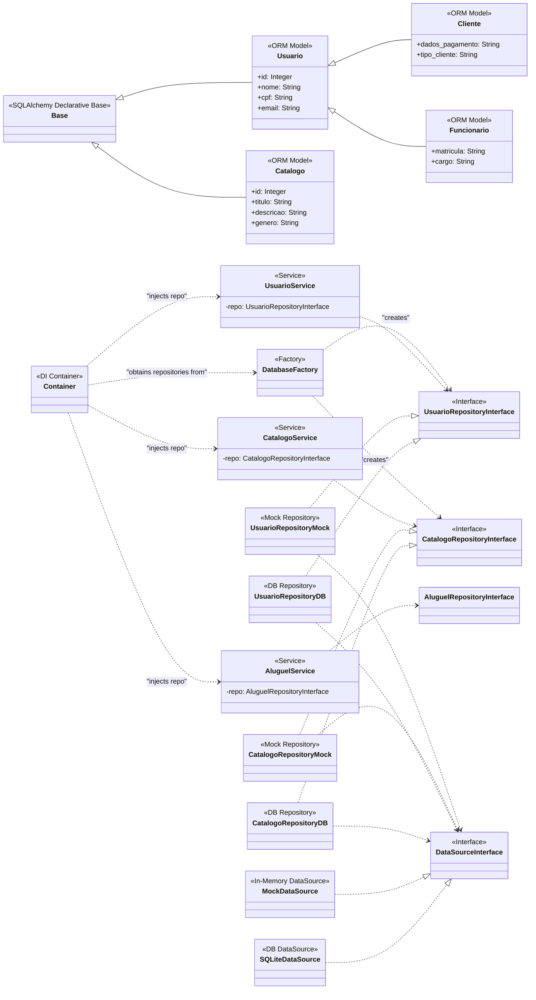

```mermaid
classDiagram
    direction LR

    class Base {
        <<SQLAlchemy Declarative Base>>
    }

    class Usuario {
        <<ORM Model>>
        +id: Integer
        +nome: String
        +cpf: String
        +email: String
    }

    class Cliente {
        <<ORM Model>>
        +dados_pagamento: String
        +tipo_cliente: String
    }

    class Funcionario {
        <<ORM Model>>
        +matricula: String
        +cargo: String
    }

    class Catalogo {
        <<ORM Model>>
        +id: Integer
        +titulo: String
        +descricao: String
        +genero: String
    }

    class AluguelService {
        <<Service>>
        -repo: AluguelRepositoryInterface
    }

    class CatalogoService {
        <<Service>>
        -repo: CatalogoRepositoryInterface
    }

    class UsuarioService {
        <<Service>>
        -repo: UsuarioRepositoryInterface
    }

    class Container {
        <<DI Container>>
    }

    class DatabaseFactory {
        <<Factory>>
    }

    class DataSourceInterface {
        <<Interface>>
    }

    class MockDataSource {
        <<In-Memory DataSource>>
    }

    class SQLiteDataSource {
        <<DB DataSource>>
    }

    class UsuarioRepositoryInterface {
        <<Interface>>
    }

    class CatalogoRepositoryInterface {
        <<Interface>>
    }

    class UsuarioRepositoryMock {
        <<Mock Repository>>
    }
    class CatalogoRepositoryMock {
        <<Mock Repository>>
    }

    class UsuarioRepositoryDB {
        <<DB Repository>>
    }
    class CatalogoRepositoryDB {
        <<DB Repository>>
    }

    Base <|-- Usuario
    Usuario <|-- Cliente
    Usuario <|-- Funcionario
    Base <|-- Catalogo

    Container ..> DatabaseFactory : "obtains repositories from"
    DatabaseFactory ..> UsuarioRepositoryInterface : "creates"
    DatabaseFactory ..> CatalogoRepositoryInterface : "creates"

    Container ..> UsuarioService : "injects repo"
    Container ..> CatalogoService : "injects repo"
    Container ..> AluguelService : "injects repo"

    UsuarioService ..> UsuarioRepositoryInterface
    CatalogoService ..> CatalogoRepositoryInterface
    AluguelService ..> AluguelRepositoryInterface

    UsuarioRepositoryMock ..|> UsuarioRepositoryInterface
    UsuarioRepositoryDB ..|> UsuarioRepositoryInterface
    CatalogoRepositoryMock ..|> CatalogoRepositoryInterface
    CatalogoRepositoryDB ..|> CatalogoRepositoryInterface

    UsuarioRepositoryMock ..> DataSourceInterface
    CatalogoRepositoryMock ..> DataSourceInterface

    UsuarioRepositoryDB ..> DataSourceInterface
    CatalogoRepositoryDB ..> DataSourceInterface

    MockDataSource ..|> DataSourceInterface
    SQLiteDataSource ..|> DataSourceInterface
```