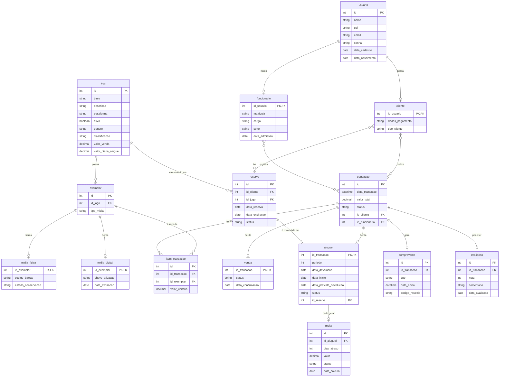
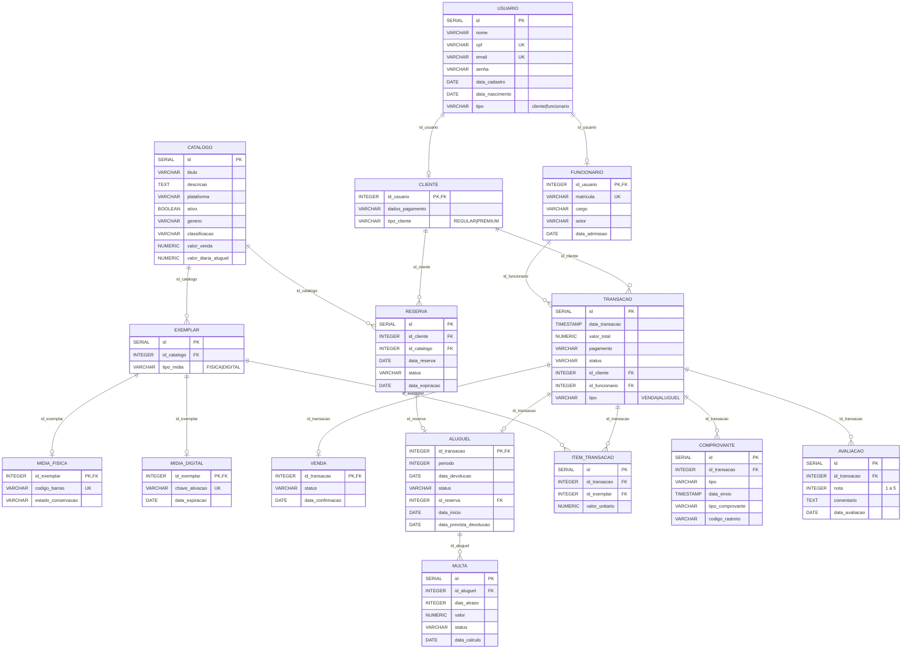

# Configuração do Banco de Dados - RetroHub

Este diretório contém todos os scripts e configurações necessários para o banco de dados PostgreSQL do projeto RetroHub.

## Estrutura de Arquivos

A inicialização do banco de dados é controlada por dois arquivos principais, que são executados em ordem alfabética pelo contêiner do PostgreSQL na primeira vez que ele é iniciado com um volume de dados vazio.

-   `schema.sql`: Este é o arquivo principal que define a **estrutura** do banco de dados. Ele contém todos os comandos `CREATE TABLE`, `CREATE TYPE` (para ENUMs), e define as chaves primárias, chaves estrangeiras e restrições. A execução deste script garante que todas as tabelas e seus relacionamentos sejam criados corretamente. (Atualizado para a arquitetura Catálogo/Exemplar).

-   `data.sql`: Após a criação da estrutura pelo `schema.sql`, este arquivo é executado para **popular** o banco de dados com dados iniciais de demonstração. Ele contém uma série de comandos `INSERT` que adicionam exemplos de usuários, clientes, funcionários, catálogo de jogos, exemplares e transações.

-   `servers.json`: Este arquivo é usado para pré-configurar a conexão com o banco de dados no **PGAdmin**. Ele informa ao PGAdmin como se conectar ao contêiner do PostgreSQL da RetroHub, para que o servidor já apareça listado na interface, simplificando o acesso durante o desenvolvimento.

## Diagrama Entidade-Relacionamento (ER)

O diagrama abaixo ilustra as principais entidades do banco de dados e como elas se relacionam (agora incluindo o modelo Catálogo vs Inventário com a entidade `Exemplar`).

### Atualizaçao do modelo

## Principais Características do Modelo

Herança com Polimorfismo

USUARIO se especializa em CLIENTE ou FUNCIONARIO via campo tipo
EXEMPLAR se especializa em MIDIA_FISICA ou MIDIA_DIGITAL via tipo_midia
Catálogo vs Estoque

CATALOGO representa a vitrine (produto)
EXEMPLAR representa cópias físicas/digitais (estoque)
Transações Polimórficas

TRANSACAO se especializa em VENDA ou ALUGUEL via campo tipo
Rastreabilidade Completa

ITEM_TRANSACAO vincula cada transação a um exemplar específico
COMPROVANTE documenta cada operação
AVALIACAO permite feedback pós-transação
Regras de Negócio

MULTA vinculada a aluguéis atrasados
RESERVA pode se converter em ALUGUEL
CLIENTE tem tipo (REGULAR/PREMIUM) para regras diferenciadas

## Como Funciona a Inicialização

Ao executar `docker-compose up` pela primeira vez:
1.  O Docker cria um volume para o PostgreSQL no diretório `resources/database/postgre`.
2.  Como o volume está vazio, o contêiner do PostgreSQL executa os scripts do diretório `/docker-entrypoint-initdb.d`.
3.  Nosso `docker-compose.yml` mapeia o `schema.sql` e o `data.sql` para este diretório.
4.  O PostgreSQL executa `schema.sql` primeiro (criando as tabelas e os ENUMs) e depois `data.sql` (populando-as com os Easter Eggs e catálogos).
5.  Em todas as inicializações futuras, como o volume de dados não estará mais vazio, esses scripts de inicialização são ignorados, preservando os dados existentes.

